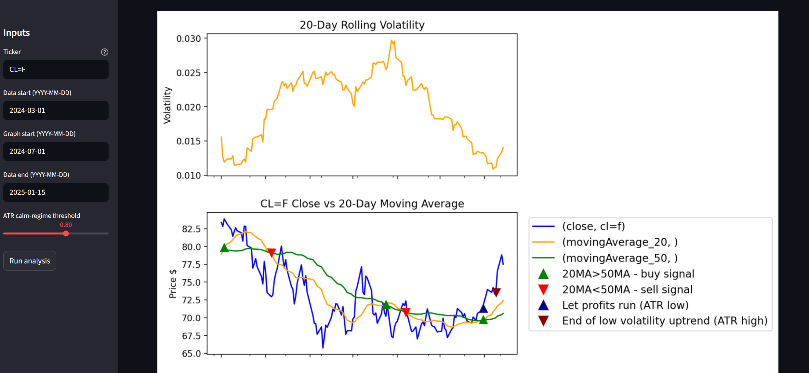

## Technical Indicators Used

All indicators are calculated manually using pandas (no external TA libraries).
The main ones used in the project are:

### • Moving Averages (20-day and 50-day)
These help identify the market trend.  
20-day MA reacts faster to price changes, while 50-day MA shows the broader direction.  
Their crossover is used to generate simple buy/sell signals.

### • RSI (14-period)
A momentum indicator showing if the market is overbought or oversold.  
Above 70 suggests overbought; below 30 suggests oversold.

### • Log Returns & Volatility
Instead of raw price changes, the tool uses log returns, which better reflect percentage moves.  
Volatility is computed as rolling standard deviation and annualised for comparability across assets.

### • ATR (Average True Range)
ATR measures how much an asset typically moves per day.  
Higher ATR = more volatility; lower ATR = calmer market.

---

## Trading & Signal Logic

### • MA Crossovers (20MA vs 50MA)
A widely used trend-following approach:

20MA crosses above 50MA → BUY  
20MA crosses below 50MA → SELL

These appear on charts as:  
🟢 Green ▲ buy markers  
🔴 Red ▼ sell markers

### • ATR Trend Regime (“Let profits run”)
Detects calm, stable uptrends where trends may persist longer:

Close > MA20 > MA50 (uptrend)  
ATR is unusually low compared to its recent average

Visual markers:  
🔵 Blue ▲ — start of calm uptrend  
🔻 Dark red ▼ — end of calm uptrend

---
### Crude Oil (CL=F)

